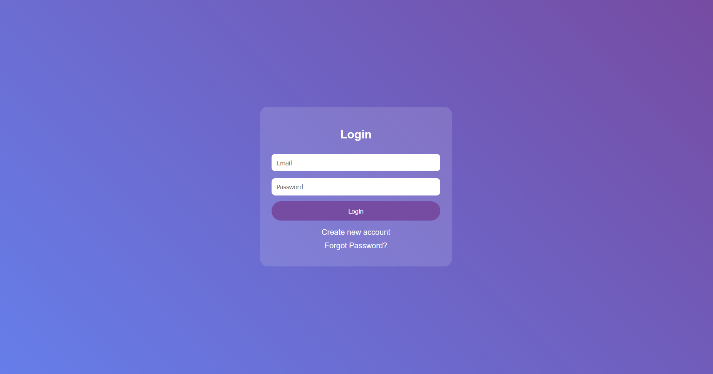

<div align="center">

# 🔐 Password Manager

*Secure • Share • Control*

[](https://kritarth.byethost14.com/password_manager/login.php)
[]()
[]()
[]()

**One master password. All accounts secure. Share safely. Control everything.**

[🚀 Try Live Demo](https://kritarth.byethost14.com/password_manager/login.php) • [📖 Documentation](#-documentation) • [⚡ Quick Start](#-quick-start)

</div>

---

## 🎯 Overview

A secure password manager that stores, encrypts, and shares your passwords with advanced security features and smart sharing capabilities.

### Why This Exists
> 💬 *"We have 100+ online accounts but can't remember secure passwords. One master password fixes everything."*

Most people use weak passwords like "123456" or reuse the same password everywhere. This creates massive security risks. Our solution: one strong master password protects everything else.

## ✨ Core Features

### 🔒 Security System
- **Encryption**: Triple-layer protection (Hash + Salt + Timestamp)
- **Recovery**: Multiple backup methods (PIN, birthdate, security questions, profession)
- **Sessions**: Auto-logout and secure session management
- **Database**: All data encrypted at storage level

### 📊 Password Management
- **Storage**: Website, Username, Email, Password, Category, Notes
- **Search**: Find passwords across all fields instantly
- **Categories**: Organize by type (Work, Personal, Banking, etc.)
- **Export**: Download all data as CSV format
- **Updates**: Modify existing entries safely
- **Deletion**: Remove unwanted passwords securely

### 🔗 Smart Sharing
- **Link Generation**: Create secure, time-limited sharing URLs
- **Email Sharing**: Send passwords directly to recipients
- **Auto-Sync**: Shared passwords update when you change them
- **Expiry System**: Links automatically become invalid
- **Revoke Control**: Cancel sharing access instantly

## 📋 Documentation

### System Architecture

```
User Input → Authentication → Encryption Layer → Database Storage
     ↓              ↓              ↓                ↓
Master Pass → Hash+Salt → Timestamp → Secure Storage
```

### Encryption Process

1. **Input**: User enters password
2. **Hashing**: Password converted to hash
3. **Salt Addition**: Random data added for security
4. **Timestamp**: Current time used as additional key
5. **Storage**: Final encrypted data saved

### Sharing Mechanism

**Link Creation Process:**
1. Generate unique secure token
2. Set expiration timestamp
3. Create shareable URL
4. Store sharing permissions

**Auto-Update Feature:**
- When password changes, system finds all shared instances
- Updates shared password automatically
- Notifies recipients of change

## 📖 Documentation

For full project details, setup instructions, and feature overview, check out the  
👉 [Well Documentation on Notion][](https://sleepy-lyric-28b.notion.site/Password-Manager-24d05f803ca580e7b954dd4251df59d9)


## 🚀 Quick Start

### Installation Requirements
- Web server with PHP support
- MySQL database
- Modern web browser
- Internet connection

### Getting Started
1. **Access**: Visit the live demo link
2. **Register**: Create account with strong master password
3. **Setup Recovery**: Add PIN, birthdate, security question
4. **Add Passwords**: Fill in your existing accounts
5. **Organize**: Use categories for better management

### First Password Entry
```
Website: facebook.com
Username: your_username
Email: your_email@example.com
Password: your_secure_password
Category: Social Media
Notes: Personal account, 2FA enabled
```

## 🛠️ Advanced Usage

### Search Functionality
- **Global Search**: Works across all fields
- **Category Filter**: Search within specific categories
- **Instant Results**: Real-time search as you type
- **Pattern Matching**: Find partial matches

### Export Features
- **Full Export**: Download all passwords as CSV
- **Selective Export**: Choose specific categories
- **Backup Creation**: Regular export for safety
- **Format**: Standard CSV for compatibility

### Sharing Best Practices
- Set reasonable expiry times (24 hours for sensitive accounts)
- Use email sharing for important credentials
- Regularly review shared passwords
- Revoke unused sharing links

## 🔒 Security Details

### Authentication Methods
- **Primary**: Master password
- **Recovery**: Security PIN (4-6 digits)
- **Backup**: Date of birth verification
- **Additional**: Security questions and profession details

### Encryption Specifications
- **Algorithm**: SHA-256 with custom salt
- **Salt Generation**: Timestamp-based unique keys
- **Key Rotation**: Automatic on password updates
- **Storage**: AES encryption for database

### Session Security
- **Timeout**: Auto-logout after inactivity
- **Token**: Secure session tokens
- **Validation**: Continuous session verification
- **Cleanup**: Automatic expired session removal

## 🖥️ Compatibility

### Supported Platforms
| Platform | Status | Notes |
|----------|--------|-------|
| Desktop Chrome | ✅ Full | Recommended |
| Desktop Firefox | ✅ Full | All features work |
| Desktop Safari | ✅ Full | Mac compatible |
| Desktop Edge | ✅ Full | Windows compatible |
| Mobile Chrome | ❌ Limited | UI not optimized |
| Mobile Safari | ❌ Limited | Touch issues |

### Browser Requirements
- JavaScript enabled
- Cookies support
- Local storage access
- Modern CSS support

## 🎯 Use Cases

### Personal Use
- **Password Vault**: Store all personal accounts
- **Family Sharing**: Share WiFi, streaming accounts
- **Travel**: Access accounts from anywhere
- **Backup**: Never lose passwords again

### Professional Use
- **Team Credentials**: Share project passwords
- **Client Access**: Provide temporary account access
- **Vendor Management**: Organize supplier accounts
- **Compliance**: Secure password policies

### Emergency Situations
- **Device Loss**: Access from any computer
- **Account Recovery**: Multiple recovery methods
- **Family Emergency**: Trusted family member access
- **Business Continuity**: Team access to critical accounts

## 📱 Screenshots




## 🤝 Contributing

### How to Help
- **Bug Reports**: Describe issues clearly with steps
- **Feature Requests**: Suggest improvements
- **Testing**: Try on different devices and browsers
- **Documentation**: Help improve guides

### Development Areas
- Mobile responsiveness improvement
- Additional authentication methods
- Enhanced search capabilities
- Bulk import/export features

## 📞 Support

### Getting Help
- **Technical Issues**: Describe problem with screenshots
- **Feature Questions**: Ask about functionality
- **Security Concerns**: Report immediately
- **General Usage**: Usage tips and tricks

### Common Issues
- **Login Problems**: Check caps lock, try recovery
- **Sharing Issues**: Verify recipient email
- **Export Problems**: Check browser download settings
- **Search Not Working**: Clear browser cache

## 📊 Technical Specifications

### Performance
- **Load Time**: Under 2 seconds
- **Search Speed**: Instant results
- **Encryption**: Millisecond processing
- **Database**: Optimized queries

### Scalability
- **Users**: Supports multiple concurrent users
- **Passwords**: Unlimited storage per user
- **Sharing**: Multiple simultaneous shares
- **Export**: Large dataset handling

### Security Standards
- **Encryption**: Industry-standard algorithms
- **Storage**: Secure database practices
- **Transmission**: HTTPS only
- **Access**: Role-based permissions

## 📜 License

MIT License - Use freely, modify, share. See [LICENSE](LICENSE) file.

---

<div align="center">

**Your passwords. Your control. Your peace of mind. 🛡️**

*Professional password management made simple*

</div>
