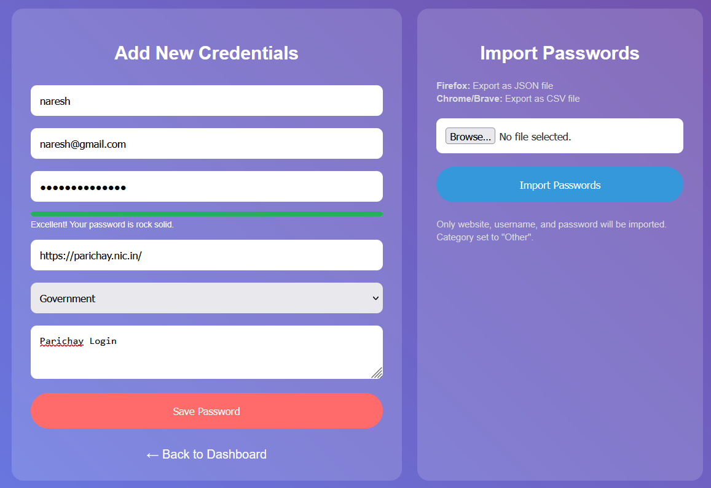

<div align="center">

# 🔐 Password Manager

*Secure • Share • Control*

[](https://kritarth.byethost18.com/password_manager/login.php)
[]()
[]()
[]()

**One master password. All accounts secure. Share safely. Control everything.**

[🚀 Try Live Demo](https://kritarth.byethost18.com/password_manager/login.php) • [📖 Documentation](#-documentation) • [⚡ Quick Start](#-quick-start)

</div>

---

## 🎯 Overview

A secure password manager that stores, encrypts, and shares your passwords with advanced security features and smart sharing capabilities.

### Why This Exists
> 💬 *"We have 100+ online accounts but can't remember secure passwords. One master password fixes everything."*

Most people use weak passwords like "123456" or reuse the same password everywhere. This creates massive security risks. Our solution: one strong master password protects everything else.

## ✨ Core Features

### 🔒 Security System
- **Encryption**: Triple-layer protection (Hash + Salt + Timestamp)
- **Recovery**: Multiple backup methods (PIN, birthdate, security questions, profession)
- **Sessions**: Auto-logout and secure session management
- **Database**: All data encrypted at storage level

### 📊 Password Management
- **Storage**: Website, Username, Email, Password, Category, Notes
- **Search**: Find passwords across all fields instantly
- **Categories**: Organize by type (Work, Personal, Banking, etc.)
- **Export**: Download all data as CSV format
- **Updates**: Modify existing entries safely
- **Deletion**: Remove unwanted passwords securely

### 🔗 Smart Sharing
- **Link Generation**: Create secure, time-limited sharing URLs
- **Email Sharing**: Send passwords directly to recipients *(Taking a Breather)*
- **Auto-Sync**: Shared passwords update when you change them
- **Expiry System**: Links automatically become invalid
- **Revoke Control**: Cancel sharing access instantly

## 📋 Documentation

### System Architecture

```
User Input → Authentication → Encryption Layer → Database Storage
     ↓              ↓              ↓                ↓
Master Pass → Hash+Salt → Timestamp → Secure Storage
```

### Encryption Process

1. **Input**: User enters password
2. **Hashing**: Password converted to hash
3. **Salt Addition**: Random data added for security
4. **Timestamp**: Current time used as additional key
5. **Storage**: Final encrypted data saved

### Sharing Mechanism

**Link Creation Process:**
1. Generate unique secure token
2. Set expiration timestamp
3. Create shareable URL
4. Store sharing permissions

**Auto-Update Feature:**
- When password changes, system finds all shared instances
- Updates shared password automatically
- Notifies recipients of change

### 📖 Documentation

For full project details, setup instructions, and feature overview, check out the:

👉 [📘 View Full Documentation](https://sleepy-lyric-28b.notion.site/Password-Manager-24d05f803ca580e7b954dd4251df59d9)


## 🚀 Quick Start

### Installation Requirements
- Web server with PHP support
- MySQL database
- Modern web browser
- Internet connection

### Getting Started
1. **Access**: Visit the live demo link
2. **Register**: Create account with strong master password
3. **Setup Recovery**: Add PIN, birthdate, security question
4. **Add Passwords**: Fill in your existing accounts
5. **Organize**: Use categories for better management

### First Password Entry
```
Website: facebook.com
Username: your_username
Email: your_email@example.com
Password: your_secure_password
Category: Social Media
Notes: Personal account, 2FA enabled
```

## 🛠️ Advanced Usage

### Search Functionality
- **Global Search**: Works across all fields
- **Category Filter**: Search within specific categories
- **Instant Results**: Real-time search as you type
- **Pattern Matching**: Find partial matches

### Export Features
- **Full Export**: Download all passwords as CSV
- **Selective Export**: Choose specific categories
- **Backup Creation**: Regular export for safety
- **Format**: Standard CSV for compatibility

### Sharing Best Practices
- Set reasonable expiry times (24 hours for sensitive accounts)
- Use email sharing for important credentials
- Regularly review shared passwords
- Revoke unused sharing links

## 🔒 Security Details

### Authentication Methods
- **Primary**: Master password
- **Recovery**: Security PIN (6 digits)
- **Backup**: Date of birth verification
- **Additional**: Security questions and profession details
- **2FA Enabled**: 2FA enabled with the authenticator app

### Encryption Specifications
- **Algorithm**: SHA-256 with custom salt
- **Salt Generation**: Timestamp-based unique keys
- **Key Rotation**: Automatic on password updates
- **Storage**: AES encryption for database

### Session Security
- **Timeout**: Auto-logout after inactivity
- **Token**: Secure session tokens
- **Validation**: Continuous session verification
- **Cleanup**: Automatic expired session removal

## 🔒 Two-Factor Authentication (2FA) via Authenticator

Enhance your account security with 2FA! When enabled, you'll need a 6-digit code from your authenticator app (e.g., Google Authenticator, Authy) when logging in.

### Setup Instructions

1. **Install an Authenticator App:**  
   Download an authenticator app on your mobile (e.g., [Google Authenticator](https://support.google.com/accounts/answer/1066447)).

2. **Enable 2FA:**  
   - Go to your account's security settings.
   - Click on "Enable 2FA."
   - Scan the displayed QR code with your app.
   - Enter the 6-digit code from your app to finish setting up.

3. **Login with 2FA:**  
   After 2FA is activated, log in using your master password plus the 6-digit code from your authenticator app.

### How It Works

This project uses PHP to generate a secret key and a QR code for your authenticator app. Each login request is validated with a one-time code generated by the app, ensuring an extra layer of security.

*For detailed developer guidance, see [docs/developer_2fa_setup.md](docs/developer_2fa_setup.md).*

## 🤖 Google reCAPTCHA Integration

Protect your forms from spam and automated abuse with Google reCAPTCHA. When enabled, reCAPTCHA requires users to verify that they are human before the form is submitted.

### How It Works

- **Client Side:**  
  The reCAPTCHA widget challenges the user to complete an action that proves they are human before form submission.

- **Server Side:**  
  Once the form is submitted, the server sends the response token to Google’s API for verification. If the token is valid, the form submission proceeds. If not, the process is halted.

This simple integration helps ensure that only real users can submit your forms, adding an important layer of protection to your application.


## 🖥️ Compatibility

### Supported Platforms
| Platform | Status | Notes |
|----------|--------|-------|
| Desktop Chrome | ✅ Full | Recommended |
| Desktop Firefox | ✅ Full | All features work |
| Desktop Safari | ✅ Full | Mac compatible |
| Desktop Edge | ✅ Full | Windows compatible |
| Mobile Chrome | ❌ Limited | UI not optimized |
| Mobile Safari | ❌ Limited | Touch issues |

### Browser Requirements
- JavaScript enabled
- Cookies support
- Local storage access
- Modern CSS support

## 🎯 Use Cases

### Personal Use
- **Password Vault**: Store all personal accounts
- **Family Sharing**: Share WiFi, streaming accounts
- **Travel**: Access accounts from anywhere
- **Backup**: Never lose passwords again

### Professional Use
- **Team Credentials**: Share project passwords
- **Client Access**: Provide temporary account access
- **Vendor Management**: Organize supplier accounts
- **Compliance**: Secure password policies

### Emergency Situations
- **Device Loss**: Access from any computer
- **Account Recovery**: Multiple recovery methods
- **Family Emergency**: Trusted family member access
- **Business Continuity**: Team access to critical accounts

## 📱 Screenshots





## 🤝 Contributing

### How to Help
- **Bug Reports**: Describe issues clearly with steps
- **Feature Requests**: Suggest improvements
- **Testing**: Try on different devices and browsers
- **Documentation**: Help improve guides

### Development Areas
- Mobile responsiveness improvement
- Additional authentication methods
- Enhanced search capabilities
- Bulk import/export features

## 📞 Support

### Getting Help
- **Technical Issues**: Describe problem with screenshots
- **Feature Questions**: Ask about functionality
- **Security Concerns**: Report immediately
- **General Usage**: Usage tips and tricks

### Common Issues
- **Login Problems**: Check caps lock, try recovery
- **Sharing Issues**: Verify recipient email
- **Export Problems**: Check browser download settings
- **Search Not Working**: Clear browser cache

## 📊 Technical Specifications

### Performance
- **Load Time**: Under 2 seconds
- **Search Speed**: Instant results
- **Encryption**: Millisecond processing
- **Database**: Optimized queries

### Scalability
- **Users**: Supports multiple concurrent users
- **Passwords**: Unlimited storage per user
- **Sharing**: Multiple simultaneous shares
- **Export**: Large dataset handling

### Security Standards
- **Encryption**: Industry-standard algorithms
- **Storage**: Secure database practices
- **Transmission**: HTTPS only
- **Access**: Role-based permissions

## 📜 License

MIT License - Use freely, modify, share. See [LICENSE](LICENSE) file.

---

<div align="center">

**Your passwords. Your control. Your peace of mind. 🛡️**

*Professional password management made simple*

</div>
